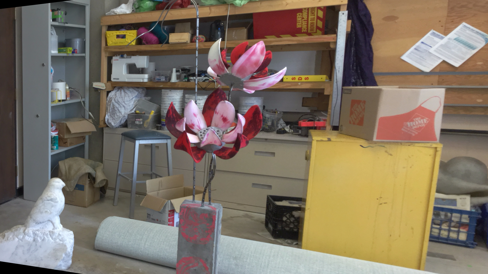
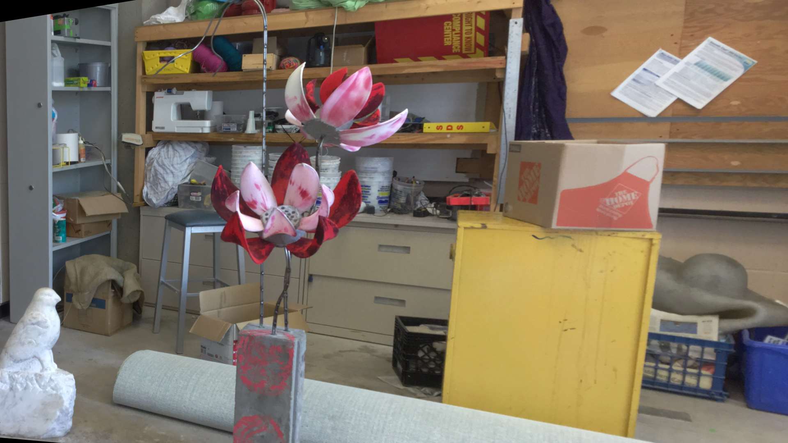

# Depth → Point Cloud (Pro)

Turn stereo pairs **or** single RGB images (MiDaS depth) into **Open3D point clouds** with a clean package, CLI, tests, and CI.




## Features
- **Stereo depth** via OpenCV (BM/SGBM) → depth map → Open3D point cloud
- **Monocular depth** via MiDaS (PyTorch Hub) → point cloud
- One-command **CLI** + minimal **Python API**
- Reproducible env (`pyproject.toml`) + basic tests + GitHub Actions CI
- Example inputs in `docs/inputs/` and result placeholders in `docs/results/`

## Quickstart
```bash
python3 -m venv .venv && source .venv/bin/activate
pip install -U pip && pip install -e .[dev]
```

### Stereo → point cloud
```bash
python scripts/depth_to_pcd.py stereo   --left docs/inputs/im0.png --right docs/inputs/im1.png   --depth-out docs/results/depth_stereo.png   --pcd-out docs/results/pointcloud_stereo.ply
```

### MiDaS (single RGB) → point cloud
> Requires internet on first run (PyTorch Hub will download the model).
```bash
python scripts/depth_to_pcd.py midas   --image docs/inputs/im0.png   --depth-out docs/results/depth_midas.png   --pcd-out docs/results/pointcloud_midas.ply
```

## Notes & assumptions
- Images should be **rectified** for stereo. If not, use your calibration first.
- Depth scale is not metric without proper camera intrinsics/baseline; this repo focuses on generating visually sensible point clouds. Provide your calibrated `fx, fy, cx, cy, baseline` for metric output.

## Results
After running the commands above, you’ll get:
- `docs/results/depth_stereo.png` and `docs/results/pointcloud_stereo.ply`
- `docs/results/depth_midas.png` and `docs/results/pointcloud_midas.ply`

## License
MIT
Dhamodar Burla